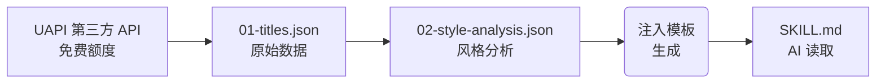

# 黑鸦 · 标题风格生成器

[](LICENSE)
[](https://agentskills.io)
[](https://www.skills.sh/chouchiu/heya.skill)
[](https://skills.sh/chouchiu/heya.skill)
[](#安装)
[](https://github.com/ChouChiu/heya.skill/actions/workflows/update-reference.yml)
> 震撼官宣！DeepSeek 服务完成提速扩容，算力霸权神话破灭，闭源大模型的斩杀线来了！| AI日报0523

基于 B 站博主 **[黑鸦](https://space.bilibili.com/3706929260006322)**（Heya）视频标题的深度分析，让 AI 学会黑鸦的标志性风格：**长标题、情绪炸弹、多事件合并**。

基于开放的 [Agent Skills](https://agentskills.io) 协议，可在 Claude Code、Codex、Cursor、OpenClaw、Gemini CLI、OpenCode 等 50+ 兼容 runtime 中运行。

## 特性

- **数据驱动**：每日自动采集 B 站黑鸦视频标题，统计分析后注入 SKILL.md
- **四种结构**：情感式 / 悬念式 / 日报式 / 对比式，每次生成 3–5 个候选
- **50+ Runtime**：基于 [Agent Skills](https://agentskills.io) 标准协议，兼容 Claude Code、Codex、Cursor、OpenClaw 等
- **零配置**：一行命令 `npx skills add ChouChiu/heya.skill` 即可接入

## 目录

- [黑鸦 · 标题风格生成器](#黑鸦--标题风格生成器)
  - [特性](#特性)
  - [目录](#目录)
  - [安装](#安装)
    - [方式一：一行命令（推荐）](#方式一一行命令推荐)
    - [方式二：手动安装](#方式二手动安装)
    - [方式三：直接粘贴](#方式三直接粘贴)
  - [使用](#使用)
  - [效果示例](#效果示例)
  - [工作原理](#工作原理)
  - [本地开发](#本地开发)
  - [项目结构](#项目结构)
  - [相关链接](#相关链接)
  - [许可证](#许可证)

## 安装

### 方式一：一行命令（推荐）

打开你正在用的 AI agent，告诉它：

```
帮我安装这个 skill：https://github.com/ChouChiu/heya.skill
```

或者用通用 CLI 安装器（[vercel-labs/skills](https://github.com/vercel-labs/skills)，支持 55+ runtime）：

```bash
npx skills add ChouChiu/heya.skill
```

安装器会自动识别你当前的 runtime。需要手动指定时加 `-a claude-code` / `-a codex` / `-a cursor` / `-a openclaw`。

### 方式二：手动安装

<details>
<summary>展开查看各 runtime 的 skills 目录</summary>

| Runtime      | 安装路径                                   |
| ------------ | ------------------------------------------ |
| Claude Code  | `~/.claude/skills/heya.skill/`             |
| Codex CLI    | `~/.codex/skills/heya.skill/`              |
| Cursor       | `~/.cursor/skills/heya.skill/`             |
| OpenClaw     | `~/.openclaw/workspace/skills/heya.skill/` |
| 其他 runtime | clone 到对应 runtime 的 `skills/` 目录     |

```bash
git clone https://github.com/ChouChiu/heya.skill <上面对应的路径>
```

</details>

### 方式三：直接粘贴

即使 runtime 不支持自动加载，你也可以直接把 [`SKILL.md`](SKILL.md) 的内容粘贴进对话——它本质就是一份 markdown + YAML frontmatter。

## 使用

装好后，告诉 agent：

```
帮我把这段 AI 新闻写成黑鸦风格的标题
用黑鸦风格给这篇文章起标题
heya style title for this AI news
```

每次生成 3–5 个候选标题，覆盖 **情感式、悬念式、日报式、对比式** 四种结构。

## 效果示例

**输入**：
<details><summary>文稿（来自橘鸦 AI 早报 2026-05-23）</summary>

```
各位观众早上好
今天是5月23日 周六
欢迎收看AI早报
屏幕上是今天的主要内容
接下来请看详细报道
DeepSeek 宣布将 DeepSeek-V4-Pro 模型 API 现有的 2.5 折优惠转为永久定价
此价格将于原定 5 月 31 日优惠结束后正式生效
智谱发布高速版旗舰模型 GLM-5.1-HighSpeed
官方称在保留原模型能力下速度达 400 tokens/s
目前仅面向部分企业客户开放
阿里宣布旗舰模型 Qwen3.7-Max
已接入千问多端供免费体验
同时有用户发现
阿里云百炼针对该模型提供限时五折优惠
OpenBMB 联合面壁智能与清华大学开源了 BitCPM-CANN 模型系列
官方称
这是首个在华为昇腾 910B 上完成端到端原生训练的 1.58-bit 三值大模型
现已提供 0.5B 至 8B 规模版本
网易有道近期推出了 Confucius4-TTS
能进行14种语言的零样本声音克隆与跨语言合成
据称3秒复刻原声且准确度超97%
模型权重即将发布
Antigravity 发布更新
将Gemini 3.5 Flash最大上下文长度翻倍
付费订阅每周 Gemini 配额提至九倍、并重置了额度
同时
新增IDE打开与安装按钮
修复了Windows故障
支持一键迁移旧设置
CLI推送新版优化体验
Claude Code 的 auto mode 现已面向 Pro 订阅用户开放
并新增对 Sonnet 4.6 和 Opus 4.7 模型的支持
终端工具 Warp 宣布向免费计划用户开放自带模型密钥功能
并全面支持兼容 OpenAI Chat Completions API 的自定义推理端点
TRAE中国版内置的 Kimi-K2.6 和 Kimi-K2.5 模型现已上线原生视频理解能力
可让 Agent 直接看懂并解析视频
Perplexity 宣布开源内部安全工具 Bumblebee
这是一款针对 macOS 和 Linux 开发终端的只读扫描器
已在 GitHub 发布
暂不支持 Windows
Anthropic 公布 Project Glasswing 进展
宣称 Claude Mythos Preview 在关键软件及开源项目中已发现超一万个高危或严重漏洞
Google DeepMind 推出 AlphaProof Nexus 框架
通过结合大型语言模型与 Lean 编译器进行数学形式化证明搜索
相关证明结果及代码已在 GitHub 公开
据报道
有关部门表示
正指导国产大模型适配国产算力芯片
谋划出台加快"人工智能+"落地配套文件
并推动央国企开放高价值应用场景
OpenAI 正在 ChatGPT 网页端测试名为 "Intelligence" 的简化版模型选择器
将原有的模型与推理档位精简为四个选项
官方确认会在全面推出前添加设置
允许用户恢复指定常用的 Pro 选项
据媒体报道
因马斯克等人游说
特朗普在最后一刻取消了原定AI安全行政令签署
相关前沿模型自愿审查机制将重新制定
今天的资讯播送完了，明天见！
```
</details>


**输出**：
```
基于文稿内容，生成5个黑鸦风格候选标题：

**1.** 震撼官宣！DeepSeek-V4-Pro永久定价引爆全网！智谱400tokens/s海啸席卷！阿里Qwen3.7-Max免费送！闭源阵营一夜蒸发！| AI日报0523
> 结构：情感式
> 说明：多事件合并（DeepSeek+智谱+阿里），使用"震撼官宣"、"引爆"、"海啸"等情绪词，符合黑鸦最常用的情感式风格

**2.** AI圈大地震！DeepSeek永久降价杀疯了！华为昇腾首个1.58-bit三值大模型横空出世！Claude Code全面开放！| AI日报0523
> 结构：情感式
> 说明：使用"大地震"、"杀疯了"等强烈情绪词，合并DeepSeek降价+华为昇腾+Claude Code三个重磅事件

**3.** 见证历史！DeepSeek-V4-Pro永久定价震撼官宣！智谱新模型400tokens/s杀疯了！阿里Qwen3.7-Max免费体验引爆全网！| AI日报0523
> 结构：情感式
> 说明：使用"见证历史"、"震撼官宣"、"杀疯了"、"引爆"等多重情绪词，强化冲击力

**4.** 后背发凉！Anthropic宣称Claude发现超一万个高危漏洞！特朗普最后一刻取消AI安全令！OpenAI紧急简化模型选择！| AI日报0523
> 结构：悬念式
> 说明：使用"后背发凉"制造悬念，合并Anthropic漏洞+特朗普取消令+OpenAI简化选择器三个事件

**5.** AI圈全面雪崩！DeepSeek永久定价引爆！智谱400tokens/s海啸！阿里Qwen3.7-Max五折杀疯了！闭源阵营一夜蒸发！| AI日报0523
> 结构：情感式
> 说明：使用"全面雪崩"、"引爆"、"海啸"、"杀疯了"等多重情绪词，强调多事件冲击力

---

**推荐使用第1或第5个**，长度适中（约55字），情绪饱满，多事件合并，最符合黑鸦风格DNA。
```

## 工作原理



| 步骤    | 说明                                                                  |
| ------- | --------------------------------------------------------------------- |
| 1. 采集 | 通过 [UAPI](https://uapis.cn) 获取黑鸦视频标题                        |
| 2. 分析 | 统计标题长度分布、情绪词频、结构占比、高频词汇                        |
| 3. 生成 | 将分析结果注入 [`SKILL.md`](SKILL.md)，形成 AI agent 可读取的风格指南 |

```bash
bun pipeline              # 全流程：采集 → 分析 → 生成
bun pipeline --skip-fetch # 跳过采集，仅分析 + 生成
```

## 本地开发

> **前置要求：** [Bun](https://bun.sh) ≥ 1.0

```bash
# 克隆项目
git clone https://github.com/ChouChiu/heya.skill
cd heya.skill

# 安装依赖
bun install

# 直接运行（零配置，使用 UAPI 免费额度）
bun pipeline

# 更多选项
bun pipeline --dry-run      # 预览步骤
bun pipeline --skip-analyze # 跳过分析，仅重新生成 SKILL.md
bun run scripts/analyze-titles.ts --top 30 # 调整分析样本量

# 代码质量
bun run lint       # Biome 检查
bun run format     # Biome 自动修复
```

## 项目结构

| 路径                   | 说明                                          |
| ---------------------- | --------------------------------------------- |
| `SKILL.md`             | 生成产物：Agent Skills 入口（AI 读取）        |
| `SKILL.example.md`     | ✏️ 模板源文件（手动编辑这个）                  |
| `scripts/pipeline.ts`  | 全流程编排：采集 → 分析 → 生成                |
| `scripts/lib/uapi.ts`  | UAPI 客户端：分页采集 B站视频标题（纯 fetch） |
| `scripts/lib/`         | 共享模块（分析引擎、分词、生成器）            |
| `references/research/` | 分析数据（JSON + MD 双格式）                  |
| `website/`             | Astro 落地页（独立项目）                      |
| `.github/workflows/`   | CI：每日自动更新 + 网站部署                   |

## 相关链接

- [Agent Skills 协议](https://agentskills.io) — 开放的 AI Skill 标准
- [skills.sh](https://skills.sh/chouchiu/heya.skill) — Skill 市场页面
- [黑鸦 B 站主页](https://space.bilibili.com/3706929260006322) — 原始风格来源

## 许可证

[MIT](LICENSE) — 随便用，随便改。

